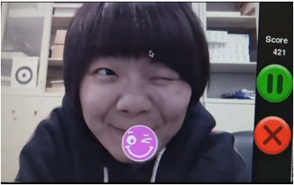

Face Dance Machine on Raspberry Pi3
==
## Author
Szu-Yu Mo（莫絲羽）<evamo.tw1@gmail.com> ;  
Yu-Shan Huang（黃郁珊）<qazwsx860809@gmail.com>

## Abstract
In this project, we have successfully developed a “face dancing machine” game on Raspberry Pi3. By “face dancing”, we simply make facial expressions identical to the cartoon emojis on the screen, just like what we do to our legs when playing traditional “dance dance revolution”. We integrated several OpenCV and Dlib functions with our own algorithms to meet the goal of recognizing facial expression in real-time. Moreover, the GUI interface is implemented via the Pygame package on Python3. The main contribution is that we have completed complex computations on an embedded system rather than on a pc, where the former only runs on ARM Cortex-A53 with 1024MB RAM.

## Demo video

## Environment
* Raspberry Pi3
* Python 3
* OpenCV 3.4.3 (NOTE: turn on NEON and VPFV3 hardware optimizations when compiling via source)
* Pygame 1.9.3
* Imutils 0.5.2
* Dlib 19.16.99 (NOTE: turn on NEON and VPFV3 hardware optimizations when compiling via source)
* Numpy
  
[id]: https://github.com/NTUEE-ESLab/2018Fall-FaceDanceMachine/blob/master/Final%20Project%20Report.pdf
The installation step of packages mentioned above are expanded in [Final Project Report.pdf][id].

## Usage
After setting up all the dependencies, we can clone the whole repository to anywhere on our computer. A model for detecting faces has to be downloaded into the same directory as well. Finally, we can run and play with the program by executing the ‘main.py’ script. Instructions are shown as the followings:
'''
$ git clone https://github.com/NTUEE-ESLab/2018Fall-FaceDanceMachine.git'
'''
download the model here: https://goo.gl/Z2JCch and put it in the above directory.  
To execute the game, run
'''
$ python3 main.py  
'''

## System structure

## Game Pages

## Facial expression
We select ten facial expressions as galleries. The photos captured by camera are first transformed into grayscale images, then we detect faces (use Dlib tool), transform them into landmarks(with pretrained detector "shape_predictor_68_face_landmarks"), and eventually compare those landmarks (target) with galleries and compute their similarity.

[id]: https://github.com/NTUEE-ESLab/2018Fall-FaceDanceMachine/blob/master/Similarity.py
What conditions we used to distinguish if a target belongs to any galleries and how we calculated their similarity are in [Similarity.py][id]

